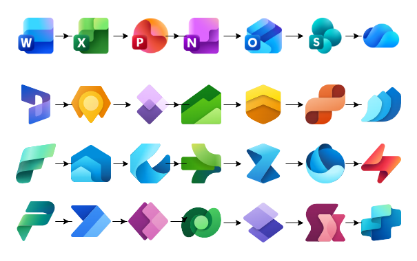

<p align="right">
    <a href="README.md"></a>
    <a href="README.en.md"></a>
</p>

# Draw.io Icon Libraries (XML) · SVG → 64×64 · WSL/Python
[](#)
[](#)
[](#)
[](LICENSE)

Collection of **icon libraries for Draw.io / diagrams.net** in `.xml` (**mxlibrary**) format, generated from SVGs normalized to **64×64**. Includes a reproducible pipeline (Jupyter or CLI) to convert SVGs to 64×64 and **package** them into libraries using `data:image/svg+xml;base64,...`.

> ⚠️ **Icons and trademarks**: icons and trademarks belong to their respective owners (e.g., Microsoft). This repo publishes *technical libraries* and *scripts*; it does **not** transfer usage rights.



---

## 🧭 Table of contents

- [✅ Requirements](#requirements)
- [📚 Included libraries](#included-libraries)
- [🚀 Quick usage in Draw.io/diagrams.net](#quick-usage-in-drawiodiagramsnet)
- [⬇️ Download](#download)
- [⭐ Support with a star](#support-with-a-star)
- [🤝 Contributing](#contributing)
- [👤 Author](#author)

---

## ✅ Requirements

### System
- **Windows 10/11** with **WSL** (Ubuntu recommended) **or** native Linux/macOS.
- **Git** (to clone and contribute).

### Python
- **Python 3.9+** (3.10/3.11 recommended).
- **pip** and **venv** available.

### Python packages (minimum)
> The scripts and notebooks use these libraries:
- `lxml` – XML validation and manipulation
- `cairosvg` – SVG rendering/conversion (and PNG if needed)
- `pillow` – image utilities (optional but useful)
- `jupyter` – to run the `.ipynb` notebooks

---

## 📚 Included libraries

`.xml` files ready to import from `/libraries`:

- Azure AI + Machine Learning.xml
- Azure Analytics.xml
- Azure App Services.xml
- Azure Blockchain.xml
- Azure Compute.xml
- Azure Containers.xml
- Azure Databases.xml
- Azure DevOps.xml
- Azure General.xml
- Azure Identity.xml
- Azure Integration.xml
- Azure Intune.xml
- Azure IoT.xml
- Azure Management + Governance.xml
- Azure Migration.xml
- Azure Monitor.xml
- Azure Networking.xml
- Azure Security.xml
- Azure Storage.xml
- Azure Web.xml
- Developing.xml
- Dynamics 365.xml
- Dynamics 365 Mixed Reality.xml
- Dynamics 365 sub app icons.xml
- Microsoft Entra ID.xml
- Microsoft Fabric.xml
- Office 365.xml
- Operating Systems.xml
- Power Platform.xml
- Programming.xml

Each entry uses `w:64`, `h:64`, `aspect:"fixed"`, `title` (from the file name) and `data:image/svg+xml;base64,...`.

---

## 🚀 Quick usage in Draw.io/diagrams.net

1. Open diagrams.net (or the Draw.io desktop app).
2. Go to `File → Open Library` and choose `File…`.
3. Import any `.xml` from `/libraries`.
4. Drag icons from the side panel onto the canvas.

---

## ⬇️ Download

[](https://download-directory.github.io/?url=https://github.com/joelarbaiza/drawio-icon-libraries/tree/main/libraries)

---

## ⭐ Support with a star

If you find this project useful, please **give it a star!** ⭐  
It helps others find the project and motivates me to keep improving it.

[](https://github.com/joelarbaiza/drawio-icon-libraries)

You can also see how many stars it has now:
[](https://github.com/joelarbaiza/drawio-icon-libraries/stargazers)

---

## 🤝 Contributing

Contributions are welcome! Add new `.xml` libraries, SVG icons, improve scripts or documentation.

### Quick flow (Fork → Branch → PR)

1. **Create a branch from `main`**  
     - New library: `feat/lib-<category>`  
     - Fix: `fix/<short-description>`  
     ```bash
     git checkout -b feat/lib-azure-networking
     ```

2. **Add source SVGs to `svg/<category>/` and normalize them**  
     Use Jupyter or CLI. Even if SVGs are already 64×64, keep the process for consistency.

3. **Generate the corresponding `.xml` in `libraries/` (mxlibrary)**  
     - The title is taken from the file name.  
     - Each item must include:  
         - `w:64`, `h:64`  
         - `aspect:"fixed"`  
         - `data:image/svg+xml;base64,...`

4. **Test import in diagrams.net / Draw.io**  
     Verify icons render and scale correctly. Optionally add screenshots to the PR.

5. **Checklist before PR**  
     - ✅ SVGs in `svg/<category>/`  
     - ✅ `.xml` generated in `libraries/`  
     - ✅ Clear names (used as `title`)  
     - ✅ Target size `64×64` and `aspect:"fixed"`  
     - ✅ Well-formed XML (CI should pass if present)  
     - ✅ Source and license documented in `docs/SOURCES.md` (if applicable)

6. **Open a Pull Request to `main` with:**  
     - Summary of changes  
     - List of icons / category  
     - Screenshots (if applicable)  
     - License/source notes

---

## 👤 Author

Joel Arbaiza – [@LinkedIn](https://www.linkedin.com/in/joelarbaiza/)
