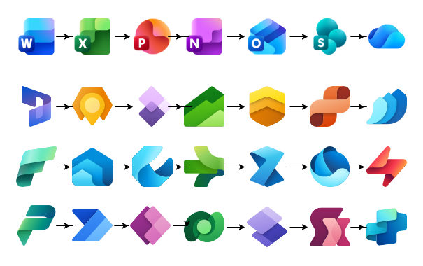
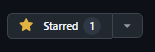

<p align="right">
  <a href="README.md"></a>
  <a href="README.es.md"></a>
</p>

# Draw.io Icon Libraries (XML) · SVG → 64×64 · Python
[](#)
[](#)
[](#)
[](LICENSE)
[](https://github.com/joelarbaiza/drawio-icon-libraries/actions/workflows/validate.yml)

Colección de **librerías de iconos para Draw.io / diagrams.net** en formato `.xml` (**mxlibrary**): **30 librerías y 723 iconos vectoriales** normalizados a **64×64**. Incluye un pipeline reproducible en Python para normalizar SVGs a 64×64 y **empaquetarlos** en librerías con `data:image/svg+xml;base64,...`.

> ⚠️ **Iconos y marcas**: los iconos y marcas pertenecen a sus respectivos titulares (p. ej., Microsoft). Este repo publica *librerías técnicas* y *scripts*; **no** transfiere derechos de uso. Consulta [docs/SOURCES.md](docs/SOURCES.md) para el origen y las condiciones de cada conjunto de iconos.



---

## 🧭 Índice

- [📚 Librerías incluidas](#librerias-incluidas)
- [🚀 Uso rápido en Draw.io/diagrams.net](#uso-rapido)
- [⬇️ Descarga](#descarga)
- [🛠️ Genera las librerías tú mismo](#generar)
- [⭐ Apóyame con una estrella](#estrella)
- [🤝 Contribuir](#contribuir)
- [👤 Autor](#autor)

---

<a id="librerias-incluidas"></a>

## 📚 Librerías incluidas

Archivos `.xml` listos para importar desde `/libraries`:

| Librería | Iconos | Librería | Iconos |
|---|---:|---|---:|
| Azure AI + Machine Learning | 33 | Azure Security | 15 |
| Azure Analytics | 17 | Azure Storage | 19 |
| Azure App Services | 8 | Azure Web | 19 |
| Azure Blockchain | 6 | Developing | 6 |
| Azure Compute | 40 | Dynamics 365 | 27 |
| Azure Containers | 7 | Dynamics 365 Mixed Reality | 7 |
| Azure Databases | 27 | Dynamics 365 sub app icons | 4 |
| Azure DevOps | 14 | Microsoft Entra ID | 7 |
| Azure General | 96 | Microsoft Fabric | 77 |
| Azure Identity | 32 | Office 365 | 29 |
| Azure Integration | 29 | Operating Systems | 3 |
| Azure Intune | 18 | Power Platform | 9 |
| Azure IoT | 29 | Programming | 43 |
| Azure Management + Governance | 33 | | |
| Azure Migration | 7 | | |
| Azure Monitor | 11 | | |
| Azure Networking | 51 | | |

Cada elemento lleva `w:64`, `h:64`, `aspect:"fixed"`, un `title` legible (p. ej. `Batch AI`, `Business Central`) y `data:image/svg+xml;base64,...`. Todos los iconos son vectoriales (sin imágenes embebidas), así que se ven nítidos a cualquier zoom.

> Algunos iconos de Azure aparecen en más de una librería de Azure, siguiendo las categorías de Microsoft.

---

<a id="uso-rapido"></a>

## 🚀 Uso rápido en Draw.io/diagrams.net

1. Abre diagrams.net (o Draw.io de escritorio).
2. Ve a `Archivo → Abrir biblioteca desde → Archivo…` (en inglés: `File → Open Library from → File…`).
3. Importa cualquier `.xml` desde `/libraries`.
4. Arrastra los iconos desde el panel lateral al lienzo. Usa el buscador para encontrarlos por nombre.

---

<a id="descarga"></a>

## ⬇️ Descarga

[](https://github.com/joelarbaiza/drawio-icon-libraries/releases/latest/download/drawio-icon-libraries.zip)
[](https://github.com/joelarbaiza/drawio-icon-libraries/releases/latest)

El ZIP contiene todas las librerías `.xml` de `/libraries`, además de `LICENSE` y `SOURCES.md` (origen y licencia de los iconos). Se genera automáticamente en cada versión publicada.

---

<a id="generar"></a>

## 🛠️ Genera las librerías tú mismo

Solo hace falta para añadir o cambiar iconos; para *usar* las librerías basta con la descarga de arriba.

### Requisitos

| Para… | Necesitas |
|---|---|
| Regenerar las librerías `.xml`, cambiar títulos, validar | **Python 3.14+** (solo biblioteca estándar) |
| Añadir o cambiar iconos (normalizar SVG a 64×64) | Python 3.14+, **[Inkscape 1.x](https://inkscape.org)** y **Pillow** (`pip install -r requirements.txt`) |

Funciona en Windows, macOS y Linux; no hace falta WSL ni Jupyter.

### Uso

```bash
python scripts/build.py list -v                  # librerías, número de iconos y su carpeta source/
python scripts/build.py pack                     # regenera todos los .xml desde las carpetas 64/ (sin Inkscape)
python scripts/build.py all -l "Azure Web"       # normaliza + empaqueta una librería (requiere Inkscape)
python scripts/validate.py                       # las mismas comprobaciones que la CI
```

Cada librería se declara en [`libraries.json`](libraries.json) (carpeta de origen, archivo de salida, reglas de título).

### Estructura del repositorio

```
libraries/<…>.xml          librerías de Draw.io (generadas — no se editan a mano)
svg/…/<librería>/source/   SVG originales del proveedor (carpeta exacta: `build.py list -v`)
svg/…/<librería>/64/       SVG normalizados a 64×64 (generados, se commitean)
libraries.json             manifiesto: qué carpeta genera cada librería y cómo se titulan los iconos
scripts/                   build.py · validate.py · compare.py · package.py · iconlib/
docs/                      SOURCES.md (origen y condiciones) · ARCHITECTURE.md (cómo funciona)
```

---

<a id="estrella"></a>

## ⭐ Apóyame con una estrella

Si este proyecto te resulta útil, **¡regálale una estrella!** ⭐  
Eso ayuda a que más gente lo encuentre y me motiva a seguir mejorándolo.

[](https://github.com/joelarbaiza/drawio-icon-libraries)

También puedes ver cuántas estrellas tiene ahora:
[](https://github.com/joelarbaiza/drawio-icon-libraries/stargazers)

---

<a id="contribuir"></a>

## 🤝 Contribuir

¡Cualquier aporte es bienvenido! Puedes añadir iconos o librerías, mejorar los scripts o la documentación.

La guía completa —añadir iconos, crear una librería, reglas de título, comprobaciones de la CI y publicación de versiones— está en **[CONTRIBUTING.md](CONTRIBUTING.md)**. En resumen:

1. Crea una rama desde `main` (`feat/lib-<librería>` o `fix/<breve-descripcion>`).
2. Pon los SVG originales en la carpeta `source/` de la librería (ver `build.py list -v`) y ejecuta `python scripts/build.py all -l "<librería>"`.
3. Ejecuta `python scripts/validate.py` y revisa los iconos en Draw.io.
4. Commitea `source/`, `64/` y el `.xml` (y `libraries.json` si es una librería nueva), documenta el origen en `docs/SOURCES.md` y abre un Pull Request hacia `main`. La CI debe pasar en verde.

Consulta [CHANGELOG.md](CHANGELOG.md) para el historial de versiones y [docs/ARCHITECTURE.md](docs/ARCHITECTURE.md) para saber cómo funciona el pipeline.

---

<a id="autor"></a>

## 👤 Autor

Joel Arbaiza – [@LinkedIn](https://www.linkedin.com/in/joelarbaiza/)
