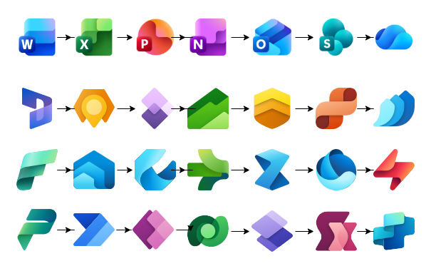
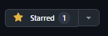

<p align="right">
  <a href="README.md"></a>
  <a href="README.en.md"></a>
</p>

# Draw.io Icon Libraries (XML) · SVG → 64×64 · WSL/Python
[](#)
[](#)
[](#)
[](LICENSE)

Colección de **librerías de iconos para Draw.io / diagrams.net** en formato `.xml` (**mxlibrary**), generadas a partir de SVGs normalizados a **64×64**. Incluye un pipeline reproducible (Jupyter o CLI) para convertir SVGs a 64×64 y **empaquetarlos** en librerías con `data:image/svg+xml;base64,...`.

> ⚠️ **Iconos y marcas**: los iconos y marcas pertenecen a sus respectivos titulares (p. ej., Microsoft). Este repo publica *librerías técnicas* y *scripts*; **no** transfiere derechos de uso.



---

## 🧭 Índice

- [✅ Requisitos](README.md#requisitos)
- [📚 Librerías incluidas](README.md#librerías-incluidas)
- [🚀 Uso rápido en Draw.io/diagrams.net](README.md#uso-rápido-en-drawiodiagramsnet)
- [⬇️ Descarga](README.md#descarga)
- [⭐ Apóyame con una estrella](README.md#apóyame-con-una-estrella)
- [🤝 Contribuir](README.md#contribuir)
- [👤 Autor](README.md#autor)


---

## ✅ Requisitos

### Sistema
- **Windows 10/11** con **WSL** (Ubuntu recomendado) **o** Linux/macOS nativo.
- **Git** (para clonar y contribuir).

### Python
- **Python 3.9+** (recomendado 3.10/3.11).
- **pip** y **venv** disponibles.

### Paquetes Python (mínimos)
> Los scripts y notebooks usan estas librerías:
- `lxml` – validación y manipulación XML
- `cairosvg` – render/conversión SVG (y PNG si se requiere)
- `pillow` – utilidades de imagen (opcional pero útil)
- `jupyter` – para ejecutar los cuadernos `.ipynb`

---

## 📚 Librerías incluidas

Archivos `.xml` listos para importar desde `/libraries`:

- Azure AI + Machine Learning.xml
- Azure Analytics.xml
- Azure App Services.xml
- Azure Blockchain.xml
- Azure Compute.xml
- Azure Containers.xml
- Azure Databases.xml
- Azure DevOps.xml
- Azure General.xml
- Azure Identity.xml
- Azure Integration.xml
- Azure Intune.xml
- Azure IoT.xml
- Azure Management + Governance.xml
- Azure Migration.xml
- Azure Monitor.xml
- Azure Networking.xml
- Azure Security.xml
- Azure Storage.xml
- Azure Web.xml
- Developing.xml
- Dynamics 365.xml
- Dynamics 365 Mixed Reality.xml
- Dynamics 365 sub app icons.xml
- Microsoft Entra ID.xml
- Microsoft Fabric.xml
- Office 365.xml
- Operating Systems.xml
- Power Platform.xml
- Programming.xml

Cada elemento lleva `w:64`, `h:64`, `aspect:"fixed"`, `title` (desde el nombre del archivo) y `data:image/svg+xml;base64,...`.

---

## 🚀 Uso rápido en Draw.io/diagrams.net

1. Abre diagrams.net (o Draw.io de escritorio).
2. Ve a `File/Archivo → Open Library/Abrir biblioteca from/Desde → File…/Archivo…`
3. Importa cualquier `.xml` desde `/libraries`.
4. Arrastra los iconos desde el panel lateral al lienzo.

---

## ⬇️ Descarga

<a href="https://download-directory.github.io/?url=https://github.com/joelarbaiza/drawio-icon-libraries/tree/main/libraries"
   target="_blank" rel="noopener noreferrer">
  
</a>


---

## ⭐ Apóyame con una estrella

Si este proyecto te resulta útil, **¡regálale una estrella!** ⭐  
Eso ayuda a que más gente lo encuentre y me motiva a seguir mejorándolo.

[](https://github.com/joelarbaiza/drawio-icon-libraries)

También puedes ver cuántas estrellas tiene ahora:
[](https://github.com/joelarbaiza/drawio-icon-libraries/stargazers)

---

## 🤝 Contribuir

¡Cualquier aporte es bienvenido! Puedes añadir nuevas librerías `.xml`, iconos SVG, mejorar scripts o documentación.

### Flujo rápido (Fork → Rama → PR)

1. **Crea una rama desde `main`**  
   - Nueva librería: `feat/lib-<categoria>`  
   - Corrección: `fix/<breve-descripcion>`  
   ```bash
   git checkout -b feat/lib-azure-networking
   ```

2. **Añade los SVG fuente en `svg/<categoria>/` y normalízalos**  
   Usa Jupyter o CLI. Si ya vienen a 64×64, mantén el proceso para consistencia.

3. **Genera el `.xml` correspondiente en `libraries/` (mxlibrary)**  
   - El título se toma del nombre del archivo.  
   - Cada ítem debe tener:  
     - `w:64`, `h:64`  
     - `aspect:"fixed"`  
     - `data:image/svg+xml;base64,...`

4. **Prueba la importación en diagrams.net / Draw.io**  
   Verifica que los iconos se vean y escalen correctamente.  
   Opcional: añade capturas para el PR.

5. **Checklist antes del PR**  
   - ✅ SVGs en `svg/<categoria>/`  
   - ✅ `.xml` generado en `libraries/`  
   - ✅ Nombres claros (se usan como `title`)  
   - ✅ Tamaño objetivo `64×64` y `aspect:"fixed"`  
   - ✅ XML “well-formed” (si hay CI, debe pasar en verde)  
   - ✅ Fuente y licencia documentadas en `docs/SOURCES.md` (si aplica)

6. **Abre un Pull Request hacia `main` con:**  
   - Resumen de cambios  
   - Lista de iconos / categoría  
   - Capturas (si aplica)  
   - Notas de licencia/fuente


---

## 👤 Autor

Joel Arbaiza – [@LinkedIn](https://www.linkedin.com/in/joelarbaiza/)